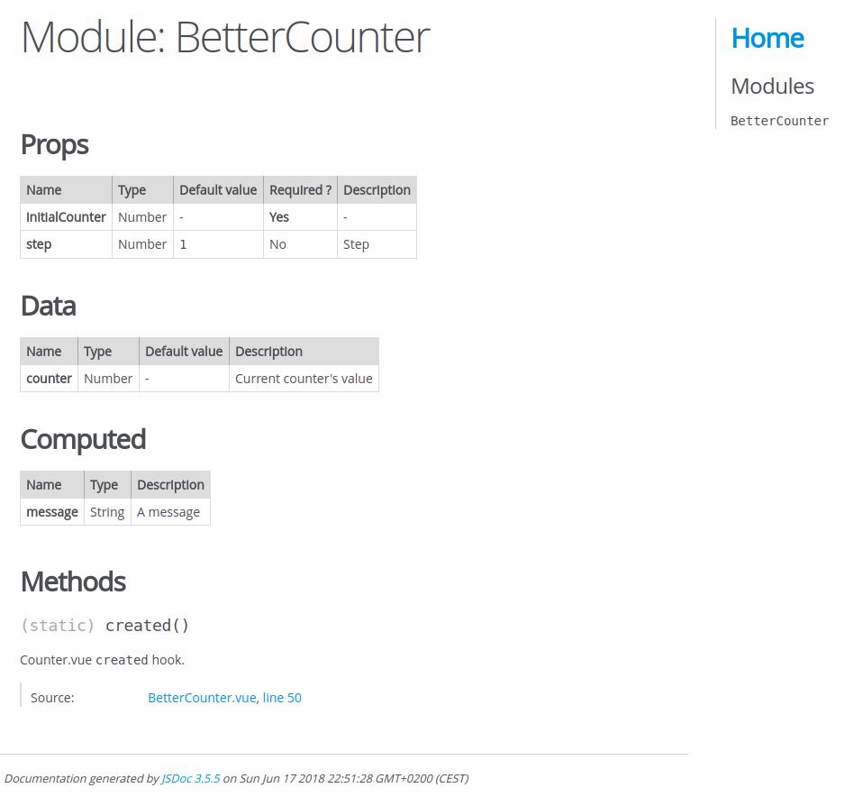
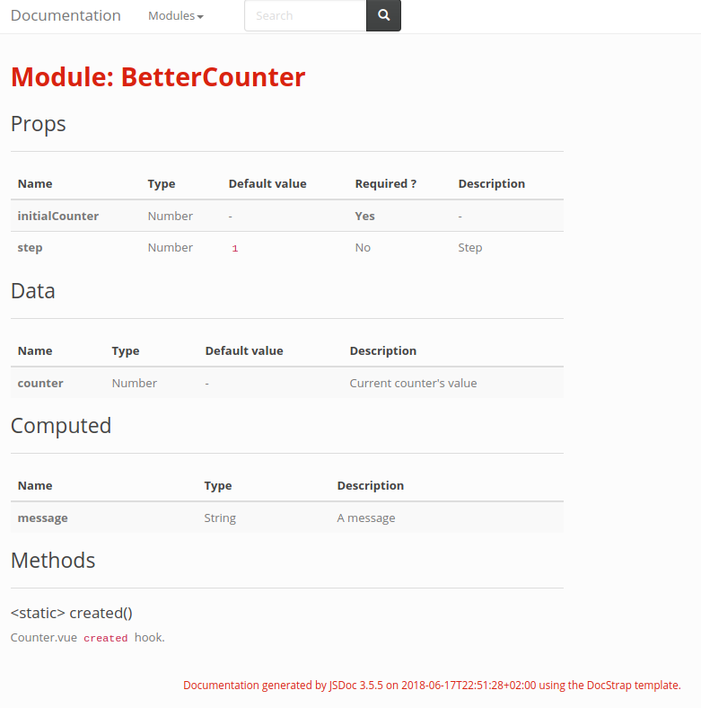
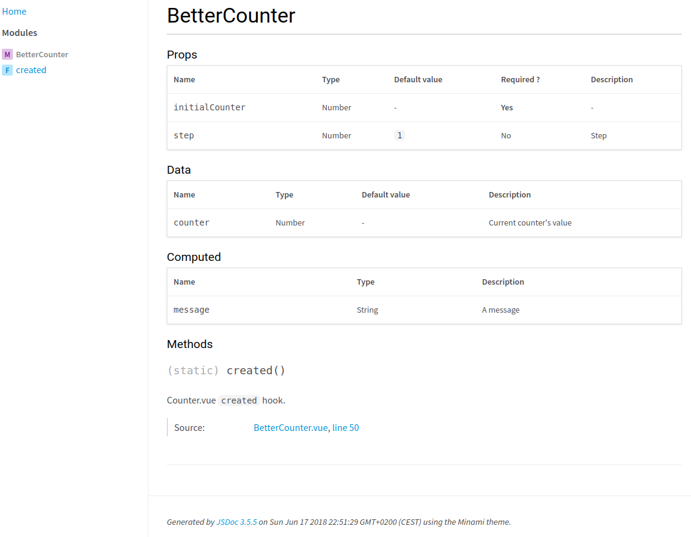
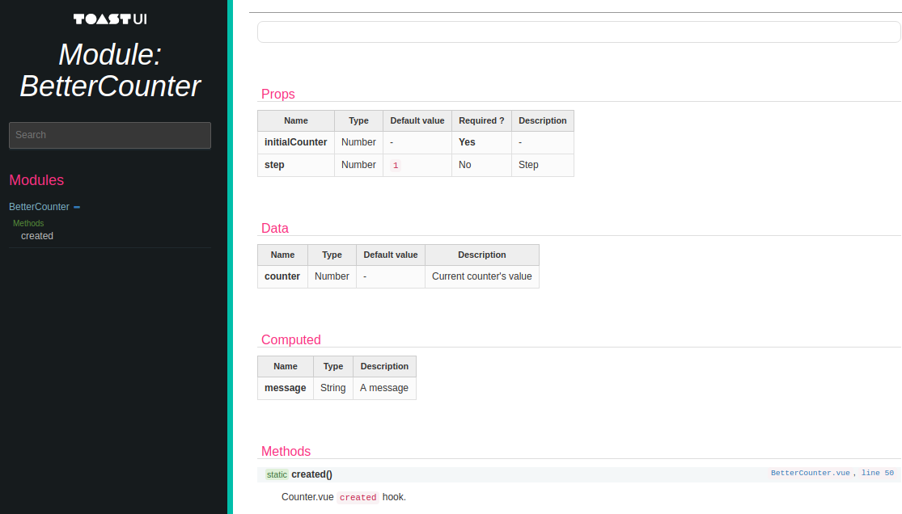

JSDoc for VueJS
===============

[](https://badge.fury.io/js/jsdoc-vuejs)
[](https://travis-ci.org/Kocal/jsdoc-vuejs)
[](https://codecov.io/gh/Kocal/jsdoc-vuejs)

> A JSDoc plugin for listing props, data, computed data, and methods from *.vue files.

## Installation

```bash
$ npm install --save-dev jsdoc-vuejs
```

## Usage

Your should update your JSDoc configuration to enable JSDoc-VueJS:

```json
{
  "plugins": [
    "node_modules/jsdoc-vuejs"
  ],
  "source": {
    "includePattern": "\\.(vue|js)$"
  }
}
```

Update your .vue files with one of the following tags:

- `@vue-prop`
- `@vue-data`
- `@vue-computed`

All of those tags work the same way than [`@param` tag](http://usejsdoc.org/tags-param.html).

```vue
<template>
  <div>Hello world!</div>
</template>

<script>
  /**
   * @vue-prop {Number} initialCounter - Initial counter's value
   * @vue-prop {Number} [step=1] - Step
   * @vue-data {Number} counter - Current counter's value
   * @vue-computed {String} message
   */
  export default {
    props: {
      initialCounter: {
        type: Number,
        required: true,
      },
      step: {
        type: Number,
        default: 1,
      },
    },
    data () {
      return {
        counter: 0,
      }
    },
    computed: {
      message() {
        return `Current value is ${this.counter}`;
      }
    }
  }
</script>
```

## Supported templates

The rendering engine has been rewritten in v2, it can supports every JSDoc templates that exists.

Actually, it supports 4 templates:
- Default
- [Docstrap](https://github.com/docstrap/docstrap)
- [Minami](https://github.com/nijikokun/minami)
- [Tui](https://github.com/nhnent/tui.jsdoc-template)

If you use a template that is not supported, it will use the default one as a fallback.

Feel free to open an issue/pull request if your template is not supported!

### Default



### [Docstrap](https://github.com/docstrap/docstrap)



### [Minami](https://github.com/nijikokun/minami)



### [Tui](https://github.com/nhnent/tui.jsdoc-template)



## Testing

### Unit

```bash
$ yarn test
```

### E2E

Before running integration tests with [Cypress](https://cypress.io), 
you should generate documentation with all renderers:

```bash
$ cd example
$ yarn
$ yarn jsdoc -d docs -c jsdoc.json
$ yarn jsdoc -d docs-docstrap -c jsdoc.json -t ./node_modules/ink-docstrap/template
$ yarn jsdoc -d docs-minami -c jsdoc.json -t ./node_modules/minami
$ yarn jsdoc -d docs-tui -c jsdoc.json -t ./node_modules/tui-jsdoc-template
$ cd ..
```

And then run Cypress:

```bash
$ yarn cypress run
```

## License

MIT.
