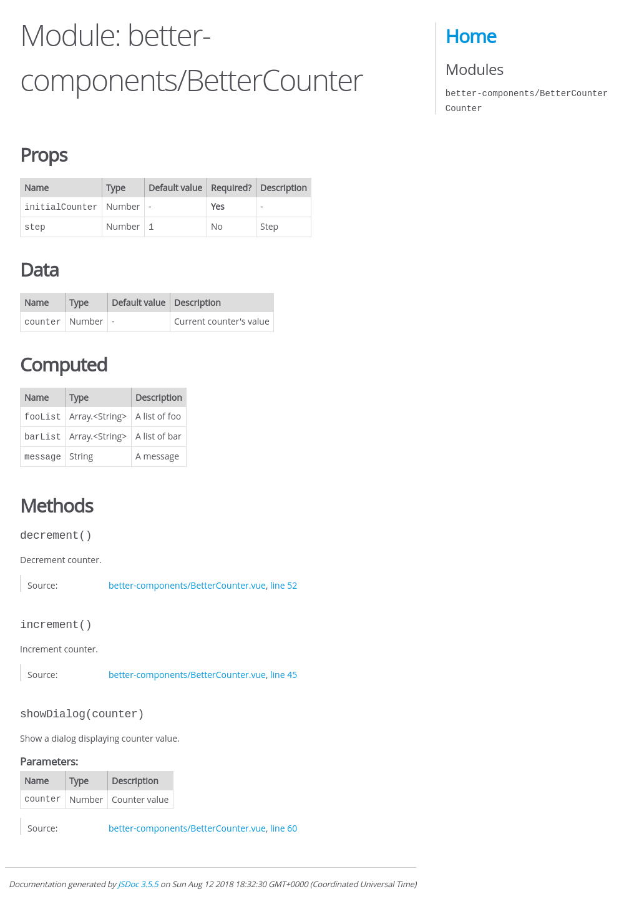
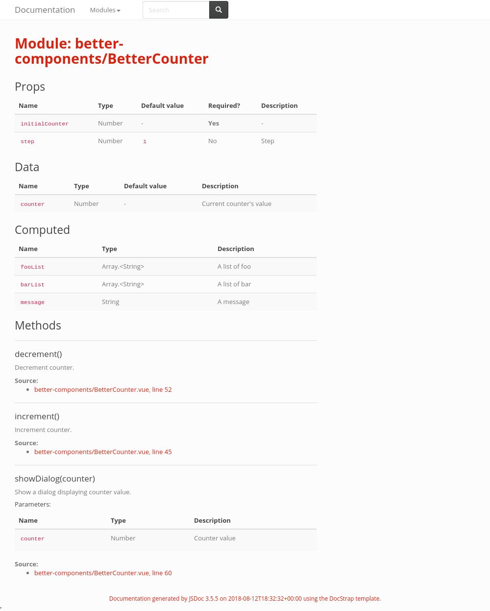
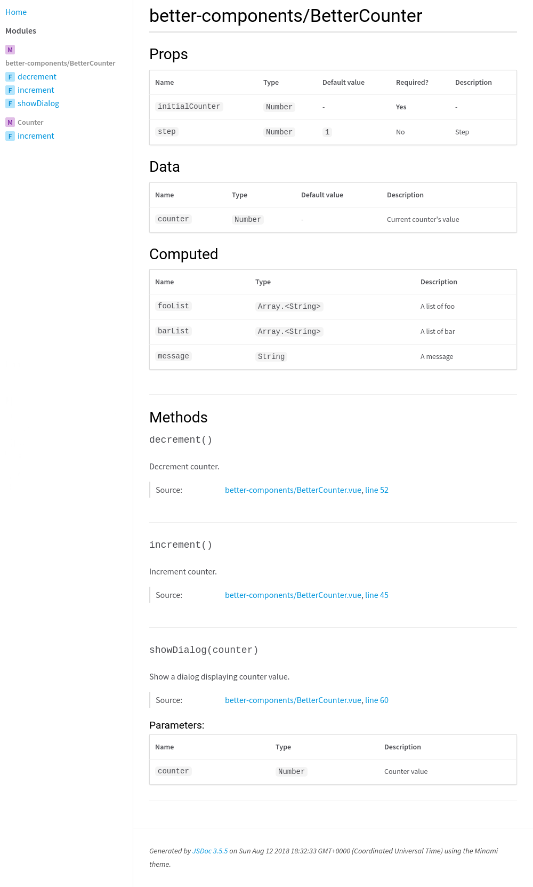
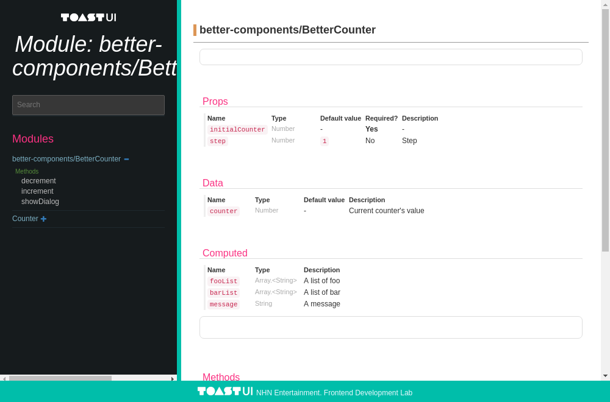

JSDoc for VueJS
===============

[](https://badge.fury.io/js/jsdoc-vuejs)
[](https://travis-ci.org/Kocal/jsdoc-vuejs)
[](https://ci.appveyor.com/project/Kocal/jsdoc-vuejs)
[](https://codecov.io/gh/Kocal/jsdoc-vuejs)
[](https://www.codacy.com/app/kocal/jsdoc-vuejs?utm_source=github.com&amp;utm_medium=referral&amp;utm_content=Kocal/jsdoc-vuejs&amp;utm_campaign=Badge_Grade)

> A JSDoc plugin for listing props, data, computed data, and methods from *.vue files.

# This branch has been fixed to work with Vue 3 compiler-sfc

## Requirements

- Node 10+
- Vue 3

## Installation

```bash
$ npm install --save-dev jsdoc jsdoc-vuejs
```

You also need to install `compiler-sfc` that match your Vue version:

```bash
# if you use Vue 3+
$ npm install --save-dev @vue/compiler-sfc
```

## Usage

Your should update your JSDoc configuration to enable JSDoc-VueJS:

```json
{
  "plugins": [
    "node_modules/jsdoc-vuejs"
  ],
  "source": {
    "includePattern": "\\.(vue|js)$"
  }
}
```

Update your .vue files with one of the following tags:

- `@vue-prop`
- `@vue-data`
- `@vue-computed`
- `@vue-event`

All of those tags work the same way than [`@param` tag](http://usejsdoc.org/tags-param.html).

```vue
<template>
  <div>Hello world!</div>
</template>

<script>
  /**
   * @vue-prop {Number} initialCounter - Initial counter's value
   * @vue-prop {Number} [step=1] - Step
   * @vue-data {Number} counter - Current counter's value
   * @vue-computed {String} message
   * @vue-event {Number} increment - Emit counter's value after increment
   * @vue-event {Number} decrement - Emit counter's value after decrement
   */
  export default {
    props: {
      initialCounter: {
        type: Number,
        required: true,
      },
      step: {
        type: Number,
        default: 1,
      },
    },
    data () {
      return {
        counter: 0,
      }
    },
    computed: {
      message() {
        return `Current value is ${this.counter}`;
      }
    },
    methods: {
      increment() {
        this.counter += 1;
        this.$emit('increment', this.counter);
      },
      decrement() {
        this.counter -= 1;
        this.$emit('decrement', this.counter);
      }
    }
  }
</script>
```

## Supported templates

The rendering engine has been rewritten in v2, it can supports every JSDoc templates that exists.

Actually, it supports 4 templates:
- Default
- [Docstrap](https://github.com/docstrap/docstrap)
- [Minami](https://github.com/nijikokun/minami)
- [Tui](https://github.com/nhnent/tui.jsdoc-template)

If you use a template that is not supported, it will use the default one as a fallback.

Feel free to open an issue/pull request if your template is not supported!

<details>
<summary>Default</summary>



</details>

<details>
<summary>Docstrap</summary>



</details>

<details>
<summary>Minami</summary>



</details>

<details>
<summary>Tui</summary>



</details>

## Testing

### Install Dependencies

```bash
$ git clone https://github.com/Kocal/jsdoc-vuejs
$ cd jsdoc-vuejs
$ yarn install

# For testing the example docs
$ cd example
$ yarn install
```

#### Generate documentations

```bash
$ cd example

# Generate docs for every renderer
$ yarn docs:all

# or one by one
$ yarn docs # default jsdoc template
$ yarn docs:docstrap
$ yarn docs:minami
$ yarn docs:tui
```

### Unit

```bash
$ yarn test
```

### E2E

Before running integration tests with [Cypress](https://cypress.io), 
you should generate documentation with all renderers:

```bash
$ cd example
$ yarn docs:all
```

And then run Cypress:

```bash
$ cd ..
$ yarn cypress run
```

## License

MIT.
